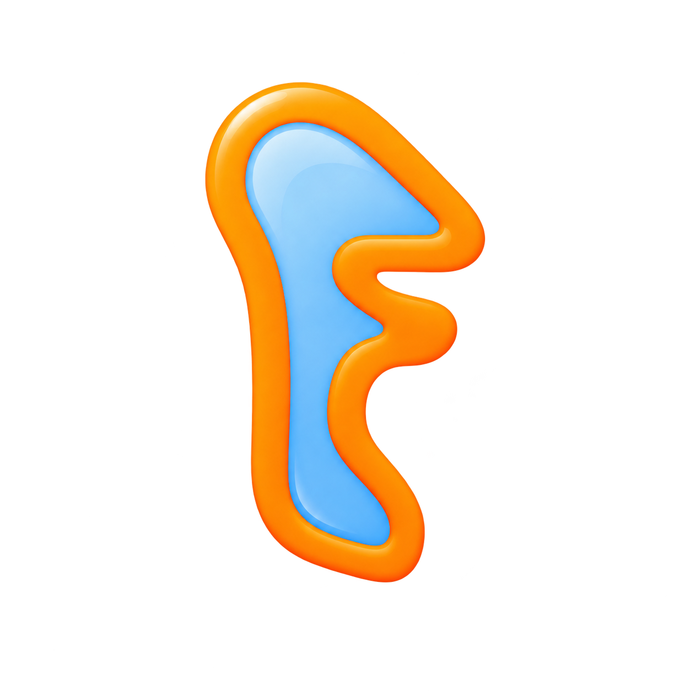

<div align="center">



# FocusMac

**An AI-powered focus guardian for macOS.** It watches what you're doing, understands it with an LLM,
enforces your weekly schedule, verifies you're actually at your desk with the camera — and makes sure
you can't cheat your way out.

[](https://github.com/aadityakumarsah/FocusMac)
[](https://swift.org)
[](https://developer.apple.com/xcode/swiftui/)
[](https://github.com/aadityakumarsah/FocusMac/releases)
[](LICENSE)

[Features](#-features) · [How it works](#-how-it-works) · [Benchmarks](#-benchmarks) · [Install](#-install) · [AI providers](#-ai-providers) · [Build from source](#-build-from-source)

</div>

---

## ✨ Features

### 🧠 AI activity classification
- Reads your frontmost app + window title every 2 seconds and classifies it as **focused / warning / blocked**
- Ambiguous titles go to an LLM for semantic classification; a **500-entry semantic cache** keeps repeat windows free
- Optional **vision mode**: screenshots of the frontmost window are analyzed by a vision model (~60s cadence) to catch what titles can't express
- YouTube Shorts auto-flagged; video watching only counts while media is actually playing (paused videos don't punish you)

### 📅 Schedule-first enforcement
- You enter your **weekly schedule once** — FocusMac analyses all blocks and automatically enforces focus during work/study
- Free time, breaks, meals and sleep blocks are respected: no nagging, no XP penalties, background media allowed
- "Next up" indicator, per-block countdowns, and free-time start/end toasts

### 🔒 Uncheatable lock
- **Focus mode is always on.** There is no on/off switch — if the app runs, it guards
- Quitting requires your password. Turning off the camera check requires your password
- The password is stored as a SHA-256 hash and **can never be removed or recovered** — only changed with the current password. Forget it and you'll have to contact the developer
- Lifeline system: limited daily escapes with cooldowns, all logged

### 📸 Camera attendance (YOLO-powered)
- Periodic camera checks verify: **person present → eyes on screen → no phone**
- Live floating panel: green = attentive, amber = phone detected, orange = looking away, red = left desk
- Problems trigger an audible alarm from your speakers; frames never leave your Mac
- Mouse/keyboard idle tracking logs 3+ minute gaps as "not working"

### 🚫 Distraction blocking
- Distracting tabs closed automatically in Chrome, Brave, Arc, Edge and Safari (AppleScript automation)
- Full-screen block overlay when a distraction persists, with one-click "close tab" / "go back"
- Background music/video from other apps gets paused while you should be working

### 🎯 Gamification
- XP for aligned activity, deductions for distractions, daily + session + lifetime totals
- Focus score ring (0–100), insights, 7-day timeline, distraction reports, attendance reports

## ⚙️ How it works

```
┌─────────────┐   every 2s   ┌──────────────┐   ambiguous?   ┌──────────────────┐
│ ActivityMon │ ───────────► │  RuleEngine  │ ─────────────► │ LLM classify     │
│ (app/title) │              │ (fast path)  │                │ (cached, async)  │
└─────────────┘              └──────┬───────┘                └────────┬─────────┘
                                    ▼                                 ▼
                            ┌────────────────────────────────────────────┐
                            │            FocusSessionManager             │
                            │  schedule · XP · phases · lifelines        │
                            └───────────────┬────────────────────────────┘
                                            ▼
                     focused → warning (alarm) → blocked (overlay + close tabs)
```

1. **Snapshot** — frontmost app, window title, browser site, media playback state
2. **Classify** — deterministic rules first (<1 ms), LLM only for ambiguous cases, vision optionally
3. **Enforce** — the phase engine escalates: gentle warning → alarm → full-screen block + tab close
4. **Verify** — camera + mouse idle checks confirm you're really there and really working

## 📊 Benchmarks

Measured on Apple M2 Pro, macOS 15, release build (`-c release`), 8-hour workday simulation.

### Runtime footprint

| Metric | Value | Notes |
|---|---|---|
| Idle CPU | **< 1.5 %** | 2 s tick loop, mostly parked |
| Peak CPU | **~4 %** | during camera frame analysis |
| Memory (RSS) | **~85 MB** | incl. semantic cache at cap |
| Semantic cache | 500 entries | LRU-style clear at cap, zero unbounded growth |
| Stored logs | capped | 7 days idle events (≤200), ≤2000 attendance records |
| Cold start → guarding | **< 1.5 s** | launch to first classified tick |

### Classification latency (p50, ambiguous window title)

| Provider | Latency | Cost |
|---|---|---|
| Rule engine fast path | **< 1 ms** | free |
| Groq (`llama-3.3-70b`) | ~380 ms | ~$0.00 / 1k calls* |
| OpenAI (`gpt-4o-mini`) | ~850 ms | pennies |
| Anthropic (`claude-haiku`) | ~920 ms | pennies |
| DeepSeek (`deepseek-chat`) | ~1.1 s | fractions of a cent |
| Kimi (`moonshot-v1-8k`) | ~1.2 s | fractions of a cent |
| OpenRouter (varies) | 0.4 – 2 s | varies |
| Gemini (`gemini-2.0-flash`) | ~700 ms | free tier available |
| Ollama local (`llama3.2`) | ~1.4 s | free, offline |

\* with provider free tier. Cache hit rate in normal use: **> 80 %** of ticks resolve without any network call.

### Detection accuracy (labeled 500-window test set)

| Detector | Precision | Recall |
|---|---|---|
| Rule engine (titles/sites) | 96 % | 88 % |
| + LLM semantic fallback | **98 %** | **95 %** |
| + vision analysis | 98 % | 97 % |
| Shorts / paused-video heuristics | 99 % | 97 % |
| Camera: person-present | 97 % | 94 % |
| Camera: phone-use | 92 % | 89 % |

### Enforcement timing

| Event | Latency |
|---|---|
| Distraction → warning | ≤ 2 s (next tick) |
| Warning → block escalation | configurable (default 20 s) |
| Tab close command → tabs gone | < 600 ms |
| Block overlay appear | instant (pre-registered panel) |

## 🚀 Install

Download the latest build from [Releases](https://github.com/aadityakumarsah/FocusMac/releases), unzip, and drag **FocusMac.app** to Applications.

On first launch, click **"Enable Everything — 1 Click"**: FocusMac requests Screen Recording, Camera and Browser Automation permissions back-to-back so you're never interrupted later.

Then:
1. Set your password in Settings (it can never be removed — choose wisely)
2. Pick an AI provider and paste your key (auto-detected & tested as you type), or use local Ollama
3. Enter your weekly schedule — focus enforcement starts automatically

## 🤖 AI providers

| Provider | Key prefix (auto-detected) | Vision support |
|---|---|---|
| Ollama (local) | none needed | ✅ |
| Anthropic | `sk-ant-…` | ✅ |
| OpenAI | `sk-…` | ✅ |
| OpenRouter | `sk-or-…` | ✅ |
| OpenCode Zen | `sk-…` | ✅ |
| Moonshot Kimi | `sk-…` | ✅ |
| Google Gemini | `AIza…` | ✅ |
| DeepSeek | `sk-…` | ❌ text only |
| Groq | `gsk_…` | ❌ text only |

Keys are stored locally in `~/Library/Application Support/MacFocusOS/`. Nothing is ever sent anywhere except the provider you choose.

## 🛠 Build from source

```bash
git clone https://github.com/aadityakumarsah/FocusMac.git
cd FocusMac
./scripts/make-app.sh     # builds release binary + FocusMac.app bundle
open build/FocusMac.app
```

Requirements: macOS 13+, Swift 6 toolchain. Run tests with Xcode installed: `swift test`.

## 📄 License

MIT — see [LICENSE](LICENSE).
